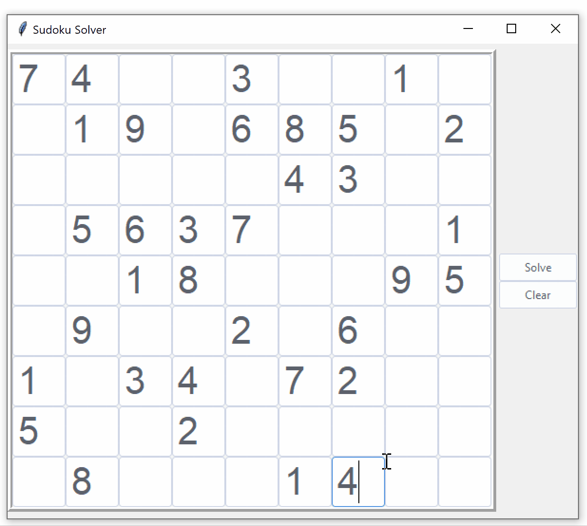
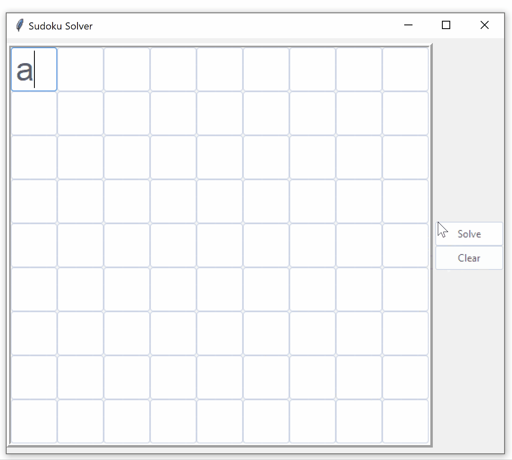
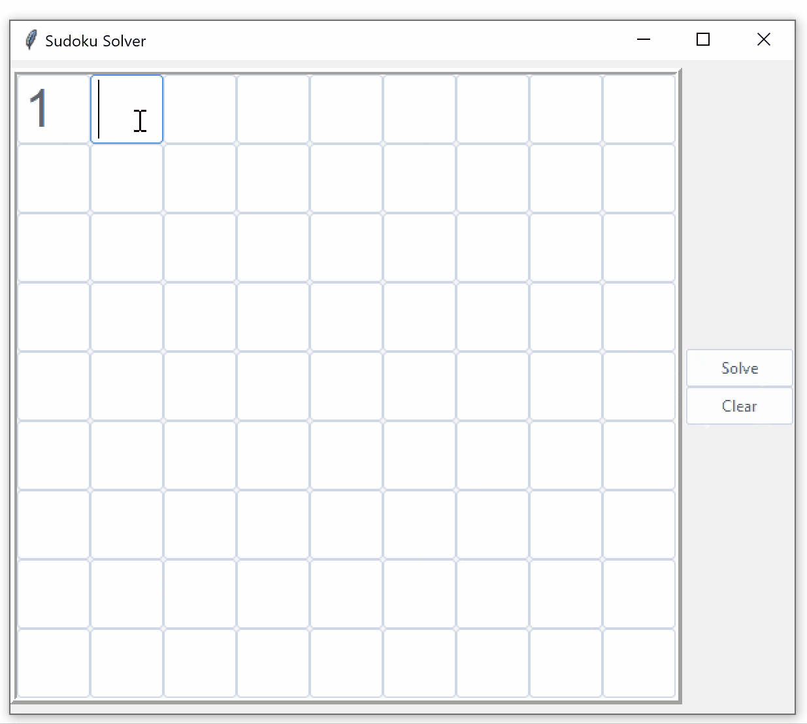

# Sudoku Solver

## Table of contents
* [Introduction](#introduction)
* [Technologies](#technologies)
* [How-to](#how-to)
* [Demo](#demo)

## Introduction
The sudoku solver uses a backtracking search to solve sudoku puzzles. It allows for the user to input their own puzzles to solve.

## Technologies
Project is created with Python 3.8.2

## How-to
The program will produce a solved board if it's solvable. It will also alert the user if the board is not solvable or if invalid input was entered.

## Demo

Solving a puzzle:
 

Detecting invalid input:
 

Detecting an unsolvable puzzle:
 

